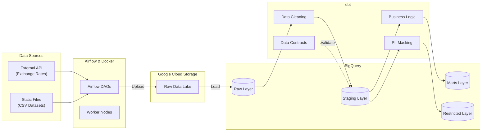

# 🛡️ Secure E-commerce Customer 360 Platform

> **An end-to-end project demonstrating Modern Data Stack (MDS) best practices.**
> This project integrates containerization, Infrastructure as Code (IaC), Data Contracts, and automated CI/CD pipelines to build a secure, scalable, and high-quality e-commerce analytics platform.

## 🏗️ System Architecture

This project adopts an **ELT (Extract, Load, Transform)** architecture, ensuring raw data integrity while providing flexible transformation logic within the data warehouse.



## 🚀 Key Engineering Highlights

### 1\. Enterprise-grade Data Security & Privacy

Designed strict PII (Personally Identifiable Information) handling mechanisms to comply with data privacy standards:

  * **Hash & Masking**: Implemented SHA256 hashing for emails/phone numbers and full masking for real names in the `Intermediate` layer, retaining only features necessary for analysis.
  * **Schema Segregation**: Enforced strict access control. General analysts can only access `olist_marts`, while authorized personnel are required for the `restricted` schema.

### 2\. Data Quality & Contracts

Implemented **dbt Model Contracts** to enforce data specifications at build time:

  * **Staging Layer Enforcement**: Strict schema enforcement prevents upstream data changes from breaking downstream models.
  * **Automated Testing**: Comprehensive test suite including Unique, Not Null, and Referential Integrity checks.

### 3\. CI/CD & Automation (DevOps)

Utilized **GitHub Actions** for continuous integration and deployment:

  * **CI (Continuous Integration)**:
      * Automated Python linting for DAG syntax checks.
      * Trigger `dbt build --target ci` on Pull Requests to validate SQL logic in an isolated schema.
  * **CD (Continuous Deployment)**: Automated deployment pipeline to production environments (Planned).

### 4\. Infrastructure as Code (IaC)

Managed GCP resources using **Terraform** to ensure environment reproducibility:

  * Defined GCS Bucket lifecycle rules for cost optimization.
  * Managed Service Account permissions using the Principle of Least Privilege.

## 🛠️ Tech Stack

| Domain | Technology | Use Case |
| :--- | :--- | :--- |
| **Orchestration** | **Apache Airflow 3.1.3** | Managing complex dependencies with TaskGroups and CeleryExecutor for concurrency. |
| **Compute** | **Docker & Docker Compose** | Encapsulating Airflow and dbt environments to eliminate "It works on my machine" issues. |
| **Warehouse** | **Google BigQuery** | Storing tiered data (Raw, Staging, Marts) and utilizing partitioning for query optimization. |
| **Transformation** | **dbt Core** | Handling data cleaning, modeling, testing, and documentation generation. |
| **Storage** | **Google Cloud Storage (GCS)** | Serving as a Data Lake for raw CSVs and API history. |
| **IaC** | **Terraform** | Automating the provisioning of GCP project resources and IAM roles. |

## 📂 Project Structure

```bash
.
├── .github/workflows/        # CI/CD Pipelines (GitHub Actions)
├── dags/                     # Airflow DAGs (Python)
│   └── upload_to_gcs.py      # Main ETL pipeline definition
├── dbt_ecommerce/            # Core dbt project
│   ├── models/
│   │   ├── staging/          # Cleaning layer (Enforced Contracts)
│   │   ├── intermediate/     # Logic layer (PII Masking)
│   │   └── marts/            # Serving layer (Business Value)
│   └── profiles.yml          # Connection settings (CI/Dev/Prod)
├── terraform/                # GCP Infrastructure definitions
├── scripts/                  # Auxiliary Python scripts (API Fetching)
├── docker-compose.yaml       # Container orchestration config
└── Dockerfile                # Custom Airflow Image (includes dbt)
```

## 📊 Data Modeling

The project follows the **Medallion Architecture** (Bronze/Silver/Gold) pattern:

1.  **Bronze (Raw)**:
      * **Source**: GCS CSVs, Frankfurter API.
      * **Process**: Loaded via `WRITE_TRUNCATE` to preserve original fidelity.
2.  **Silver (Staging/Intermediate)**:
      * **Process**: Type casting (String -\> Numeric), Timezone standardization, Surrogate Key generation.
      * **Security**: PII masking and hashing execution.
3.  **Gold (Marts)**:
      * `core`: Clean Fact/Dim tables optimized for BI tools.
      * `marketing`: (Restricted) Contains sensitive data required for specific customer segmentation.

## ⚡ Performance Optimization

Optimized for local Docker development environments to handle resource constraints:

  * **OOM Prevention**: Implemented **Chunked Upload** (10MB chunks) in Python scripts to prevent memory overflows during large file transfers.
  * **Concurrency Control**: Tuned `AIRFLOW__CORE__PARALLELISM` and Worker Concurrency to prevent container overload.
  * **Docker Image Optimization**: Created a custom `Dockerfile` with `no-install-recommends` and apt-cache cleaning to minimize image size.

## 🏃‍♂️ Quick Start

### Prerequisites

  * Docker & Docker Compose
  * GCP Service Account Key (JSON)

### 1\. Environment Setup

```bash
# Clone the repository
git clone https://github.com/PoChaoWang/Secure-E-commerce-Customer-360-Platform.git
cd Secure-E-commerce-Customer-360-Platform

# Configure GCP Credentials
mkdir -p .secrets
cp /path/to/your/key.json .secrets/gcp-key.json

# Set Environment Variables
echo "GCP_PROJECT_ID=your-project-id" > .env
```

### 2\. Launch Services

```bash
# Build and start containers (includes installing dbt dependencies)
docker-compose up -d --build
```

### 3\. Run Pipeline

1.  Access Airflow UI (http://localhost:8080).
2.  Enable the `olist_etl_pipeline` DAG.
3.  Trigger DAG (Optional param: `{"full_refresh": true}` to rebuild schemas).

-----

## 📝 License

Apache License 2.0